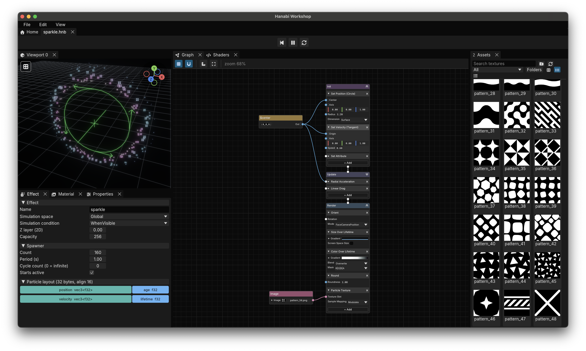

# 🎆 Hanabi Workshop

🎆 Hanabi Workshop is a visual node graph editor for
the [🎆 Bevy Hanabi](https://github.com/djeedai/bevy_hanabi) VFX plugin of Bevy.
It edits a stable, serializable effect graph, bakes that graph into a Hanabi `EffectAsset`, and previews the result live.



🚧 This project is under active development.

## Features

- Multi-document effect editing with undo/redo.
- Node-based expression and modifier authoring.
- Live particle preview with helper gizmos.
- Inspection of generated WGSL shader code.
- Particle layout inspection.
- Editing of user properties, texture slots / materials.
- Bundled sample pattern textures and example effects.
- `.hnb` graph save/load, plus import of existing baked `EffectAsset` files.

## Installation

### GitHub Releases

GitHub releases is the primary publishing mechanism. Portable archives will be published on the
[GitHub Releases](https://github.com/djeedai/hanabi-workshop/releases) page once a first version is ready.
Each release contains Windows x86_64, Linux x86_64, and Apple Silicon macOS
archives, a `SHA256SUMS` file, and GitHub build-provenance attestations.

The builds are unsigned:

- On Windows, SmartScreen may show an unrecognized-app warning. Select **More
  info**, verify the publisher and downloaded checksum, then select **Run
  anyway**.
- On macOS, Gatekeeper may block the first launch. In Finder, Control-click the
  application, select **Open**, then confirm **Open** after verifying the
  downloaded checksum.
- On Linux, extract the tarball and run `./hanabi-workshop`.

### Building from source

The minimum supported Rust version is 1.95.

```sh
cargo run
```

## `.hnb` versioning

Every released version of Hanabi Workshop and `hanabi_effect_graph` reads all earlier released `.hnb` schema versions, unless otherwise specified.
Saving an older file upgrades it to the current schema.
Older applications are not expected to read newer schema versions.

The `.hnb` schema version is independent from application and crate SemVer:
compatible additive changes use serde defaults without changing the format version;
breaking representation or semantic changes add an ordered migration and increment the format version.

## Workspace crates

- [`hanabi_effect_graph`](crates/hanabi_effect_graph): Serializable authoring model, `.hnb` loader, validation, baking, and baked-asset import.
- [`hanabi_node_graph`](crates/hanabi_node_graph): Reusable `egui` node-graph canvas with caller-owned topology and state.

The application and both libraries use independent SemVer streams.

## Assets and licenses

Source code is available under either Apache-2.0 or MIT.
Bundled fonts, textures, and Rust dependencies retain their own licenses; release archives and the in-app About dialog include the generated third-party notices.

See [`LICENSE-APACHE2`](LICENSE-APACHE2), [`LICENSE-MIT`](LICENSE-MIT), and `THIRD_PARTY_LICENSES.txt`.
