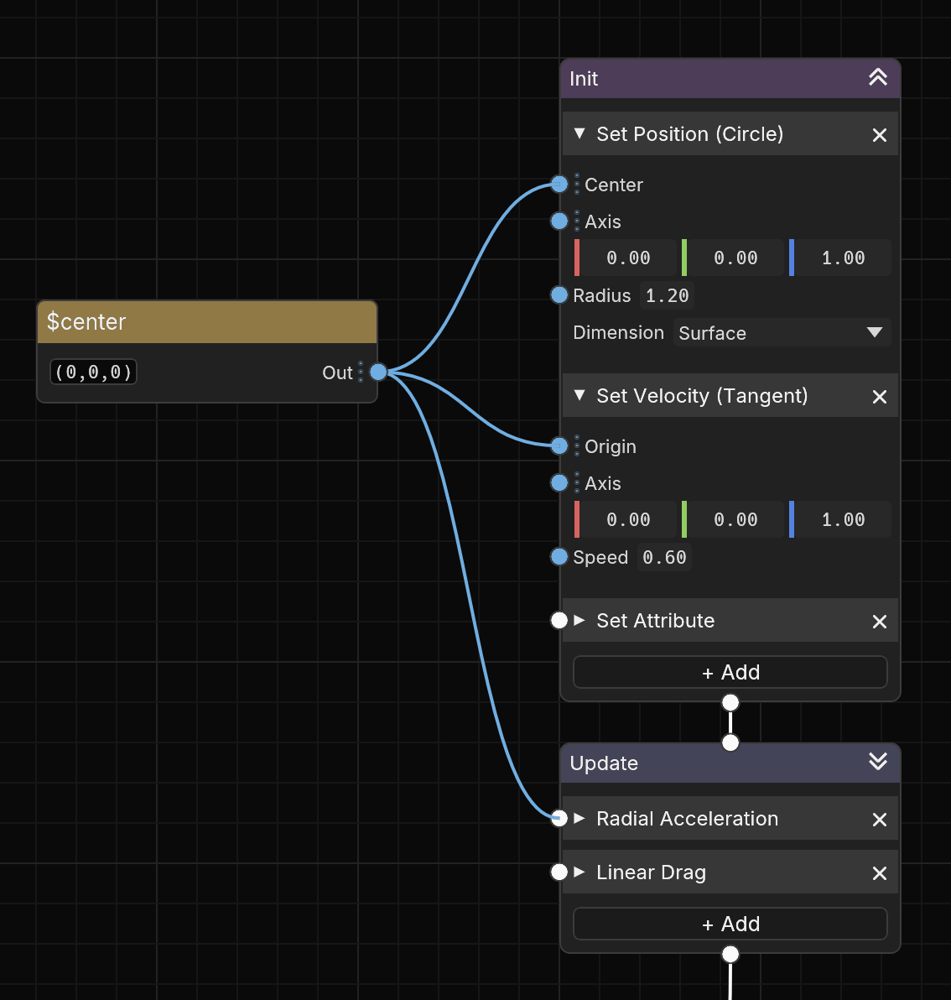

# 🎆 Hanabi Node Graph

The `hanabi_node_graph` crate provides a generic reusable node graph canvas for [`egui`](https://crates.io/crates/egui), with a
caller-owned topology and persistent view state.



The crate provides an infinite pan/zoom canvas, nodes and typed ports, spline
links, stack containers, selection and reordering, inline value chips, and
external drop targeting. It does not own an application graph or mutate domain
data.

## Usage

Implement `GraphViewer` to describe the graph, keep a `GraphView` with the
document, and apply the actions returned by `NodeGraph::show`:

```rust
let response = NodeGraph::show(
    ui,
    &mut graph_view,
    &viewer,
    |ui, node_rect, chips| paint_inline_editors(ui, node_rect, chips),
);

for action in response.actions {
    apply_to_your_model(action);
}
```

See the public API documentation for `GraphViewer`, `GraphView`,
`GraphResponse`, and the node/port descriptors.

## Compatibility

| `hanabi_node_graph` | egui | Minimum Rust |
| --- | --- | --- |
| 0.1 | 0.34 | 1.95 |

Versions below 1.0 follow SemVer's pre-1.0 rules: breaking public API changes
increment the minor version.

This crate is developed as part of
[Hanabi Workshop](https://github.com/djeedai/hanabi-workshop).

## License

Licensed under either Apache-2.0 or MIT, at your option.

`SPDX-License-Identifier: MIT OR Apache-2.0`
